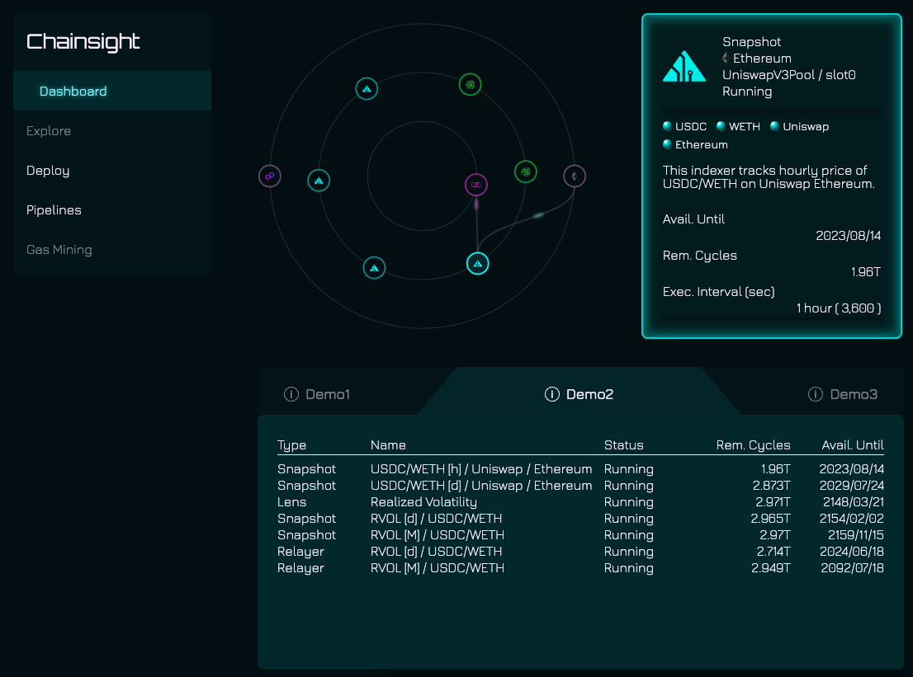
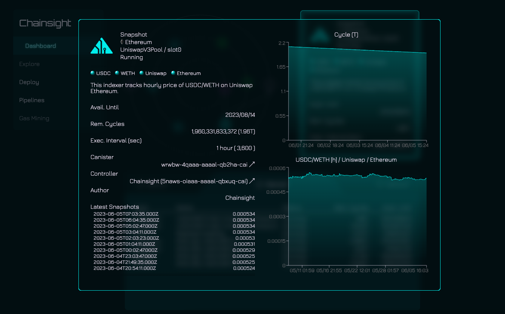
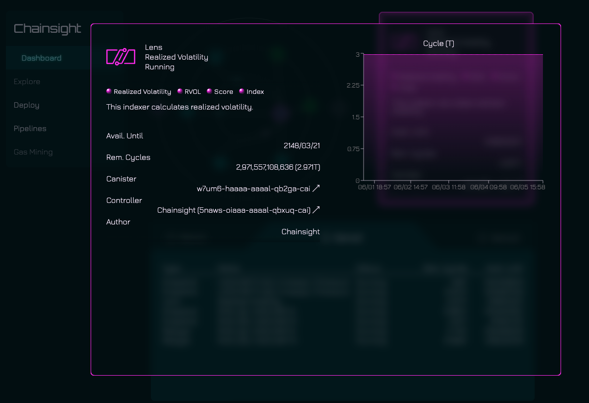
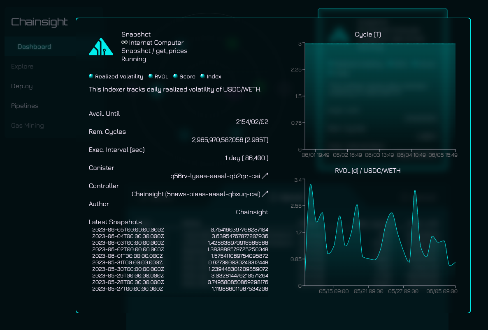
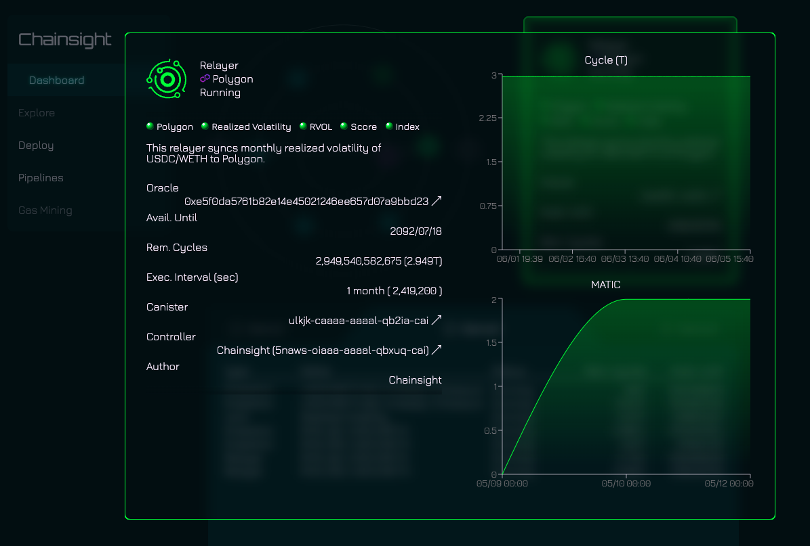
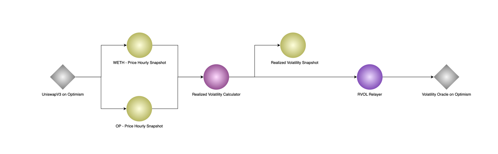

[](LICENSE)

# demo-volatility-oracles

Chainsight platform demo to integrate with Uniswap V3

- Stores Uniswap V3 prices as time series data
- Calculates a financial index (Realized Volatility)
- Synchronizes the calculated index with other blockchains

## Demo Application Images

<div>
  <div style="margin: 8px; display: flex; justify-content: center;">
    
  </div>
  <table>
    <tr>
      <td></td>
      <td></td>
    </tr>
    <tr>
      <td></td>
      <td></td>
    </tr>
  </table>
</div>

## Design



### Uniswap v3 Pool Exchange Rate

The `exchange_rate` is calculated by using the value obtained from the following view function of UniswapPoolV3.

- sqrtPriceX96 from UniswapPoolV3#slot0
- blockTimestamp from UniswapPoolV3#observations
  - Used for mapping price to the relevant date and time

ex: USDC/WETH

```txt
exchange_rate = {(sqrtPriceX96)^2 / 2^192}
  * 10^6  // USDC decimals
  / 10^18 // WETH decimals
```

ref: [A primer on Uniswap v3 math: As easy as 1, 2, v3](https://blog.uniswap.org/uniswap-v3-math-primer)

### Realized Volatility (RVOL)

RVOL is derived by using the exchange_rate `Pt` corresponding to a certain time range `t` calculated by the above formula, using `N` number of data for the period under consideration, and applying the following formula.

ex: Calculate daily RVOL

- t: 1day
- N: 24
- Pt,i:  The `i` th exchange rate belonging to period `t`
  - `Pt,0` exchange_rate corresponds to YYYYMMDDT00:00:00Z
  - `Pt,1` exchange_rate corresponds to YYYYMMDDT01:00:00Z

```math
RVOL_{t} = \sqrt{N_{1}} \times \sqrt{\frac {\sum_{i=1}^N r_{t,i}^2} N}
```

```math
r_{t,i} = 100 \times ln(P_{t,i}/P_{t,i-1})
```

## More information

- About Chainsight
  - [Introduction - Chainsight Network](https://docs.chainsight.network/)
- About Integration
  - In case of Uniswap: [Decentralized Asset Rating Oracles powered by Uniswap v3 and Chainsight](https://horizonx.notion.site/Decentralized-Asset-Rating-Oracles-powered-by-Uniswap-v3-and-Chainsight-b041d201532c4f97ba3a634c45b9a04f)
